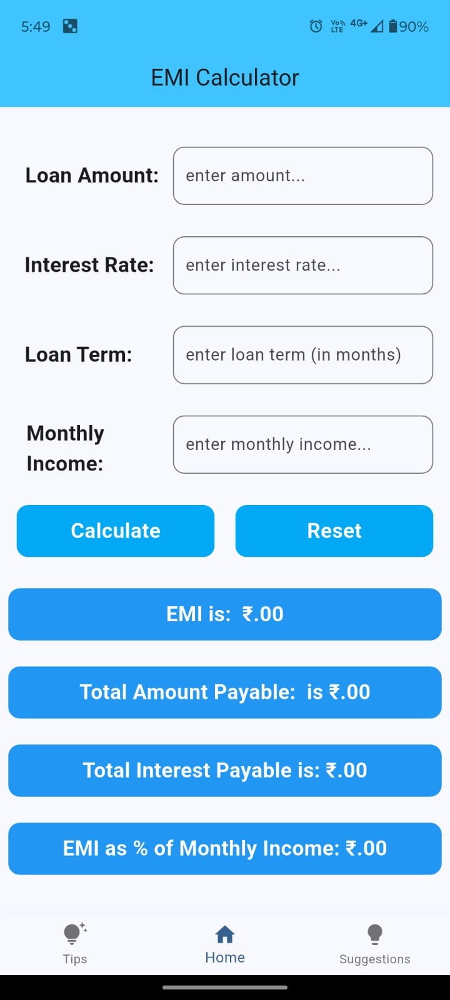
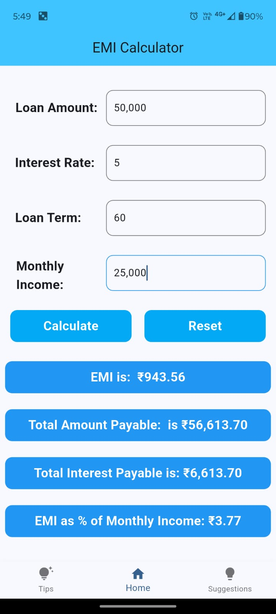
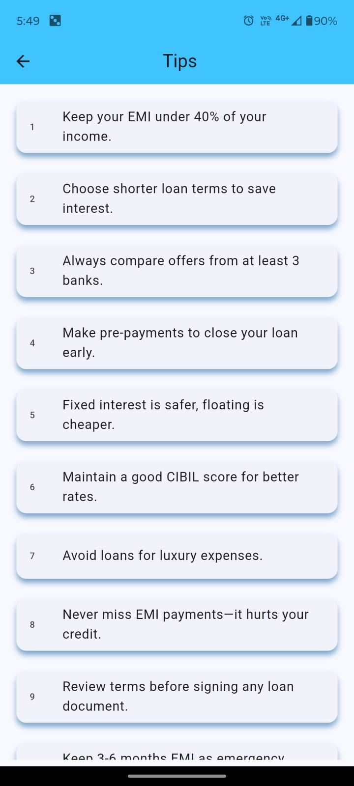

# 💰 EMI Calculator App (Flutter)

A cross-platform mobile application built with **Flutter** that helps users calculate their **Equated Monthly Installments (EMI)**, gives **smart loan suggestions** based on monthly income, and provides **useful financial tips** for better money management.

---

## 📱 App Overview

This EMI Calculator app is designed for users looking to:

- Calculate EMI for a loan based on inputs like loan amount, interest rate, and term.
- Understand how much loan is **safe to borrow** based on income.
- Learn essential **financial tips** to avoid debt traps.

---

## 🚀 Features

✅ **EMI Calculation** — Based on standard EMI formula  
✅ **Smart Loan Suggestion** — Uses 40% income rule for safe borrowing  
✅ **Financial Advice** — Shows top 10 practical EMI tips  
✅ **Formatted Inputs** — With auto-comma formatting using `intl`  
✅ **Splash Screen** — Custom loading experience  
✅ **Bottom Navigation Bar** — For seamless switching between screens  
✅ **Responsive UI** — Works on both Android and iOS

---

## 📊 EMI Formula Used

> **EMI =** \[P × R × (1 + R)^N] / [(1 + R)^N – 1]

Where:
- `P` = Principal (Loan Amount)
- `R` = Monthly Interest Rate = Annual Rate / 12 / 100
- `N` = Loan term in months

💡 **Loan Suggestion** = What you can safely borrow if your EMI is ≤ 40% of your monthly income  
*(assumed interest rate = 10%, term = 60 months)*

---

## 🛠️ Technologies & Packages

| Tool / Package           | Purpose                            |
|--------------------------|------------------------------------|
| `Flutter`                | Cross-platform UI framework        |
| `Dart`                   | Programming language               |
| `intl`                   | Number formatting (commas, ₹)      |
| `material`, `cupertino`  | Flutter widgets and design support |

---

## 📂 Folder Structure

lib/
├── main.dart # Home screen with calculator
├── suggestion.dart # Suggestion screen logic
├── chatbot.dart # Tips screen
├── splashscreen.dart # Splash screen

assets/images/
├── emmi.png # App logo
├── suggestion.jpg # Suggestion screen image

assets/screenshots/
├── starting_screen.jpg
├── home_page.jpg
├── emi_calculation.jpg
├── suggestion_before.jpg
├── suggestion_after.jpg
├── tips_page.jpg

---

## 📷 Screenshots

> Below are actual app screenshots showing various screens of the EMI Calculator App.

### 🚀 Splash Screen

### 🏠 Home Page

### 🧮 EMI Calculation

### 💡 Loan Suggestion (Before Calculation)

### 💰 Loan Suggestion (After Calculation)

### 🧠 Tips Section

---

## ✨ Author

**Anuj Kumar**  
GitHub: [AnujSingh096](https://github.com/AnujSingh096)  

